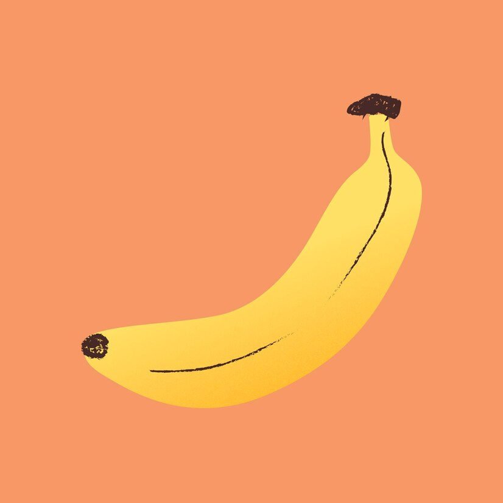

# Important Title

Unimportant text.

Other paragraph.

This is **important**.

This is also *important*.

My taylor is ***rich***.

## Header level 2

### Header level 3

#### Header level 4 

##### Header level 5

###### Header level 6

List of colours:

1. Orange
1. Red
1. Blue
1. Yellow
1. Pink
1. Grey

List of fruits:

* Cherry
* Banana
* Orange
* Apple
* Strawberry

List of animals:

1. Insects
    1. ant
    1. spider
1. Mammals
    1. dog
    1. cat
    1. dolphin
1. Fish
    1. salmon
    1. monkfish

>To be or not to be that is the question

Java is a program language we use and to compile weneed the `javac` command.

This is HTML:
````html

<p>This is a paragraph</p>
<p>This is another paragraph</p>
````
Code in Java:
````java
System.out.println("Hello World!");
````



[IES San Clemente](https://www.iessanclemente.net/)

Mestre IES San Cemente

<https://mestre.iessanclemente.net/>
